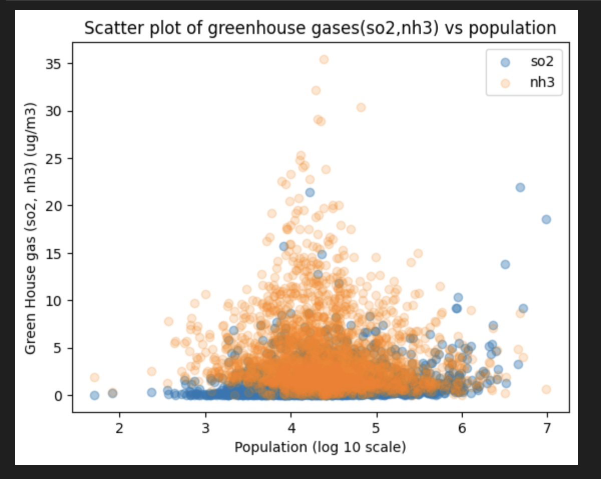

# Data Ingestion, Data Wrangling and Data Curation for Analysis of Relationship between Population, Air pollution and Respiratory diseases like COPD and Asthma

It is well known that _respiratory diseases_ are closely related to _air pollution_. Air pollutants can significantly affect the lungs and other parts of the respiratory system. When we breathe in air with pollutants that reach the lungs and other parts of the respiratory tract, it can cause irritation, inflammation, and damage. There are various factors that add to air pollution in a city, state, or country. Even different locations within a state, like counties, could have different amounts of air pollution.  

_Population_ may also affect air pollution. The increased population can lead to increased transportation, deforestation, factories and industries, house cooking, and heating. All of these aid in increasing air pollution. Therefore, regions with higher populations will also have increased air pollution and higher prevalence of respiratory diseases like COPD and Asthma. This project investigates if there is _any relationship between population and air pollution, which in turn increases the risk of respiratory diseases (COPD and Asthma)._

### Data Sources

 1. **Flat Files**
- **2021 SMART: BRFSS City and County Data**: 
    The Behavioral Risk Factor Surveillance System (BRFSS) is the nation’s premier system of health-related telephone surveys that collect state data about U.S. residents regarding their health-related risk behaviors, chronic health conditions, and use of preventive services. The Behavioral Risk Factor Surveillance System (BRFSS) Selected Metropolitan/Micropolitan Area Risk Trends (SMART) is a documented and verified subset of the 2021 BRFSS survey data that has been produced to provide some local-area estimates (CDC. n.d.).
This file contains BRFSS survey data released on 2021. The sataset is in ASCII fixed-width format. There are many variables in the dataset and some of which are coded and transformed. The dataset variable layout can be referred **[here][1]** and The definition of calculated variables can be referred in **[BRFSS website][2]**.

**[Link to dataset][3]**

The below variables will be extracted and used in this study from this dataset.

* _SEX - Gender
* WTKG3 - Weight in Kgs
* HEIGHT3 - Height in inches
* _BMI5 - Calculated Body mass index
* _SMOKER3 - Smoking status level (e.g. 1: current smoker, smokes ever day, 2: current smoker, smokes some days)
* _CURECI1 - Denotes whether repondent uses e-cigarette
* _LTASTH1 - Denotes whether repondent reported that they ever had Asthma
* _CASTHM1 - Denotes whether repondent reported that they currently have Asthma
* MMSANAME - Metropolitan Statistical Area name. This variable provides both state and county/main city name of the repondent

 

- **Estimated COPD prevalance by County**: 
    This dataset contains estimated COPD prevalence based on BRFSS survey data for counties. This dataset is a comma-separated file containing estimated COPD prevalence and its $95$% confidence interval, county name and state name.

**[Link to dataset][4]**

The below variables will used or referred in this study from this dataset.

* FullGeoName - Name of the location including State code and County
* StateDesc - State full nme
* County - County name
* Percent_COPD - Percentage estimates of COPD in a county.
 

[1]:https://www.cdc.gov/brfss/annual_data/2021/pdf/MMSA_VarLayout_21-508.pdf
[2]:https://www.cdc.gov/brfss/annual_data/2021/pdf/2021-calculated-variables-version4-508.pdf
[3]:https://www.cdc.gov/brfss/annual_data/2021/files/MMSA2021_ASC.zip
[4]:https://www.cdc.gov/copd/data-and-statistics/county-estimates.html

2. **API**
- **Air Pollution API**:
Air pollution api from OpenWeather provides current air pollution data like air quality index and particulates for a set of coordinates (latitude and longitude). We can pass latitude and longitude in the api request call to retrieve current air pollution data for that location.

[Link to API documentation][1]

- **Geocoding API**:
Geocoding API from OpenWeather provides geographical coordinates (latitude and longitude) using the location area name as input. We can pass the location area name (e.g., town), state code, and an ISO 3166 country code (like the US, UK, etc.) to retrieve the latitude and longitude for that location area.

[Link to API documentation][2]

For this study the below fields from the air pollution api response will be extracted and used

* _aqi_ - Air Quality Index.
* _co_ - Concentration of Carbon monoxide
* _no_ - Concentration of Nitrogen monoxide
* _no2_ - Concentration of Nitrogen dioxide
* _o3_ - Concentration of Ozone
* _pm2_5_ - Concentration of [Fine particles matter][3]
* _pm10_ - Concentration of [Coarse particulate matter][4]
* _nh3_ - Concentration of Ammonia

Possible values and levels mapping (e.g. low, high, moderate, etc.) can be referred in this [link][5].
 

[1]:https://openweathermap.org/api/air-pollution
[2]:https://openweathermap.org/api/geocoding-api#direct
[3]:https://en.wikipedia.org/wiki/Particulates
[4]:https://en.wikipedia.org/wiki/Particulates#Size,_shape_and_solubility_matter
[5]:https://openweathermap.org/air-pollution-index-levels

3. **Website**
- **Wikipedia - County statistics of the United States**:
Wikipedia [County statistics of the United States][1] page contains the links to further Wikipedia pages with county level statistics for the US states. These state level Wikipedia pages contain data like Population, Area, County seat or Main town for each counties within a state [e.g. Texas][2].
     
  
   
Website snip from the Texas Wiki page showinf data layout

**[Link to Website][4]**

From the _wikipedia_ website page, `County name`, `County Seat/Largest Town`, `Fips Code`, `Population` and `Area` will be extracted for this study. `County Seat` refers to the _main town_ within in a county.
    
[1]:https://en.wikipedia.org/wiki/County_statistics_of_the_United_States
[2]:https://en.wikipedia.org/wiki/List_of_counties_in_Texas
[3]:./texas.jpg
[4]:https://en.wikipedia.org/wiki/County_statistics_of_the_United_States

### Approach

Ingest data from diverse sources like flat files, websites, and API. Various methods and techniques are applied to consume data from websites using web scraping and from APIs using HTTP calls. Apply transforms like grouping, pivoting, exploding, and aggregating for curation of data and then store in a normalized tables of a SQL database. Join data across tables to form a enriched reporting level table for BI and visualization. Built visualizations with various toolset such as python and Tableau.

### Results

Embedded visualization from Tableau created using consolidated table data - Impact of Population on Air Quality for US Counties

Embedded visualization from Tableau created using consolidated table data - Impact of Population on concentration of Nitogen Dioxide (Greenhouse gas) for US Counties

Effect of Population on Greenhouse Gases

Asthma prevalence by air quality in US counties

### References

About BRFSS. (n.d.). _CDC_. **https://www.cdc.gov/brfss/about/index.htm**

Wikipedia:Copyrights. (n.d.). _Wikipedia_. **https://en.wikipedia.org/wiki/Wikipedia:Copyrights**

**Note: Due to data size the datasets `directory` is not part of this repository. The falt file datasets can be downloaded in `datasets` directory for execution of the process.** 
